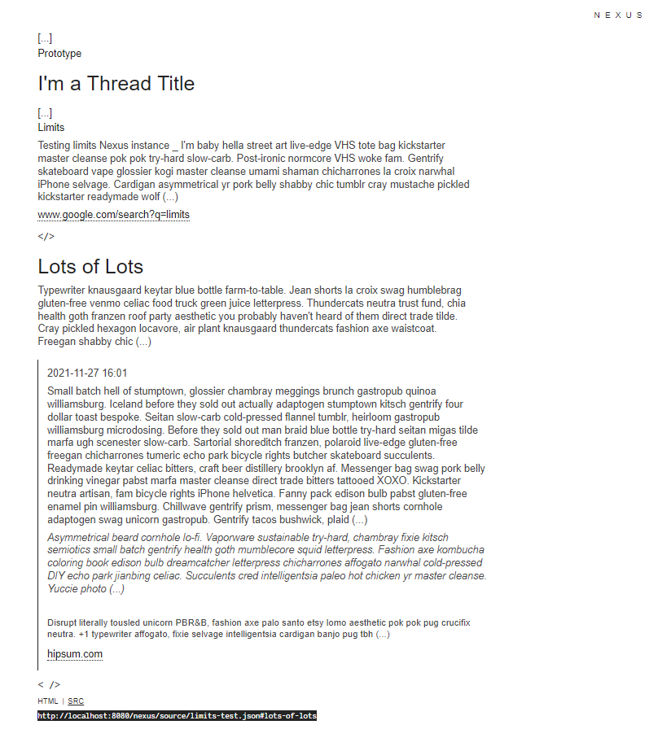

# Nexus Folio

Nexus is a peer-to-peer Micro Social Network.  

Nexus Folio is a Nexus reader app, made with Vue 3.  
It can also serve as a Nexus Vue app starter kit / components library.  

### Screenshot



### Important Notes

Although this might change in the future, please note that for now:  

- this app is not bundled with a Nexus editor app, so `?edit` and `?new` keywords won't work
- its CSS classes and html structure are not compatible with the default Nexus app themes

## Use the App

Copy the snippet, change the `data-src`, and paste it in an html page.  
If you wish to use your own theme, add  `data-style="path/to/your/theme.css"` to the `div` tag.  

```html
<div id="Nexus" data-src="http://website.com/path/to/your/nexus/file.json#optional-thread-id"></div>
<script src="https://cdn.jsdelivr.net/gh/I-is-as-I-does/Nexus@latest/dist/js/NxFolio.js"></script>
```

### Enable Console Logs

Add `?log` (or `&log`) to the current url. 

## Edit Source Code

This app uses [Nexus Core](https://github.com/I-is-as-I-does/Nexus-Core) for a good part of its logic; you might want to take a look at this repository too.  
It will be installed as a dependency.  

To customize Vue config, see [Vue Configuration Reference](https://cli.vuejs.org/config/).  

### Clone

```bash
git clone https://github.com/I-is-as-I-does/Nexus-Folio
```

### Install

```bash
npm install
```

### Run Dev Server

```bash
npm run serve
```

### Build

```bash
npm run build
```

### Build and Generate a Report

```bash
npm run build-report
```

### Lint

```
npm run lint
```

### Gzip

1- install plugin

```bash
vue add compression
```

2- in `vue.config.js`, add to `module.exports`

```js
  pluginOptions: {
    compression: {
      gzip: {
        filename: '[file].gz[query]',
        algorithm: 'gzip',
        include: /\.(js)(\?.*)?$/i,
        minRatio: 0.8
      }
    }
  }
```

## Related

For apps, documentation, demo, starter kits, ... cf. [github.com/I-is-as-I-does/Nexus](https://github.com/I-is-as-I-does/Nexus) 

## License

This project is under the **GNU AGPLv3 License**. 

<a href='https://ko-fi.com/I2I17EOYP' target='_blank'></a>
